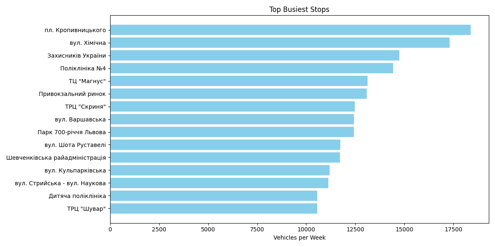
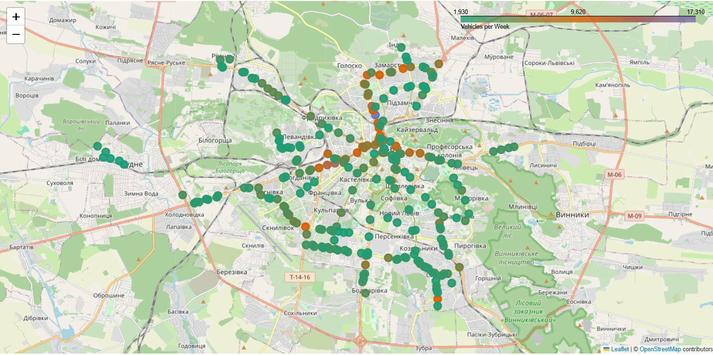
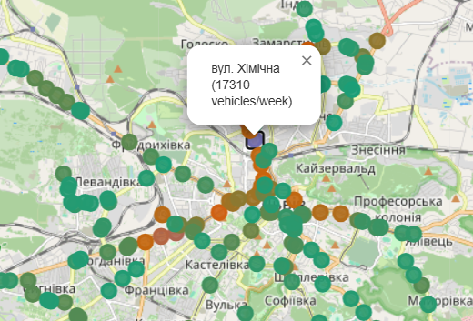
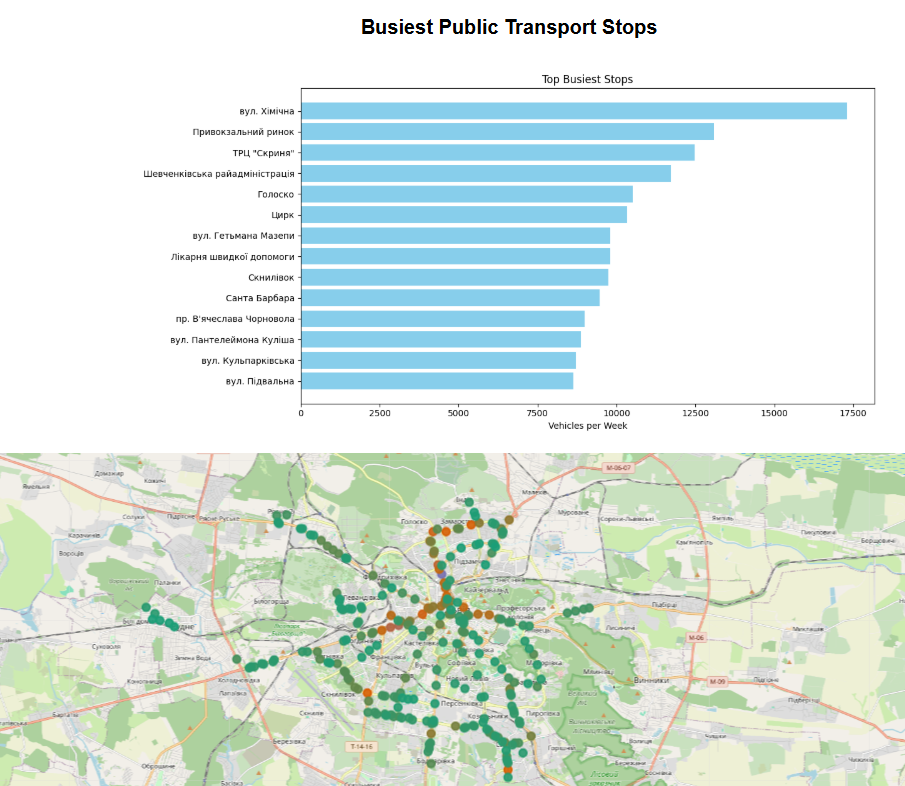

# Public Traffic Analysis Tool
A python script that identifies the most high-traffic locations in Lviv based on public transport data from an external website. May help find best places for commercial purposes (e.g. retail)

### Features
- Asynchronous data fetching
- Data parsing into structured tables
- High-traffic locations are identified based on the number of vehicles (trams, trolleybuses and minibuses) per week
- Analysis also accounts for vehicles that are not on route every day (e.g. only on weekends)
- Clustering multiple stops together if they are very close (e.g. less than 50 meters away)
- Bar chart generation for top high-traffic locations
- Interactive, draggable map generated with colored markers to show top locations
- Logging for info, warning and error messages
- Users may choose the number of top locations seen in the chart or on the map, as well as the minimal distance for clustering
- PEP-8 compliant code with type hints and type annotations

### Installation and usage guide
1. Clone the repository
   ```bash
   git clone https://github.com/sofiahnatiuk/traffic-analysis.git
   cd traffic-analysis
   ```
2. Install the dependencies
   ```bash
   pip install -r requirements.txt
   ```
3. Run (with default arguments)
   ```bash
     python main.py
   ```
4. Run (with custom arguments)
   ```bash
     python main.py --map_top 200 --chart_top 15 --eps 100
   ```
5. Get help
   ```bash
   python main.py --help
   ```
 - Output:

  ```bash
  usage: main.py [-h] [--map_top MAP_TOP] [--chart_top CHART_TOP] [--eps EPS]

  Analyze and report on busiest public transport stops

  optional arguments:
    -h, --help            show this help message and exit
    --map_top MAP_TOP     Number of top busiest stops to include on the map
    --chart_top CHART_TOP
                          Number of top busiest stops to include in the chart
    --eps EPS             Clustering radius in meters for nearby stops
  ```

### Sample results:
When the program finishes running, 'reports/bar_chart.png' is created. This image is a diagram showing top busiest locations. Sample chart for top 15 locations:



Then, a map with top locations is generated in 'reports/map.html'. The map is scallable and draggable. Sample map for top 200 locations:



Get more information for each location with a click:



A combined result with both the map and the chart is available at 'reports/combined_report.html':



Also, 'reports\busiest_stops.csv' includes the list of the most popular locations, the estimated traffic per week as well as coordinates.

### Result analysis
Based on the received results, the most high-traffic locations in Lviv include "вул. Хімічна", "Привокзальний ринок", "Шевченківська райадміністрація". The least popular locations inlcude "Мотозавод", "вул. Вільхова", "вул. Вівсяна".

### Technologies used
  - Python 3.10
  - requests - for data fetching
  - pandas, numpy - for data analysis
  - matplotlib - for chart visualisation
  - folium - for map visualization

